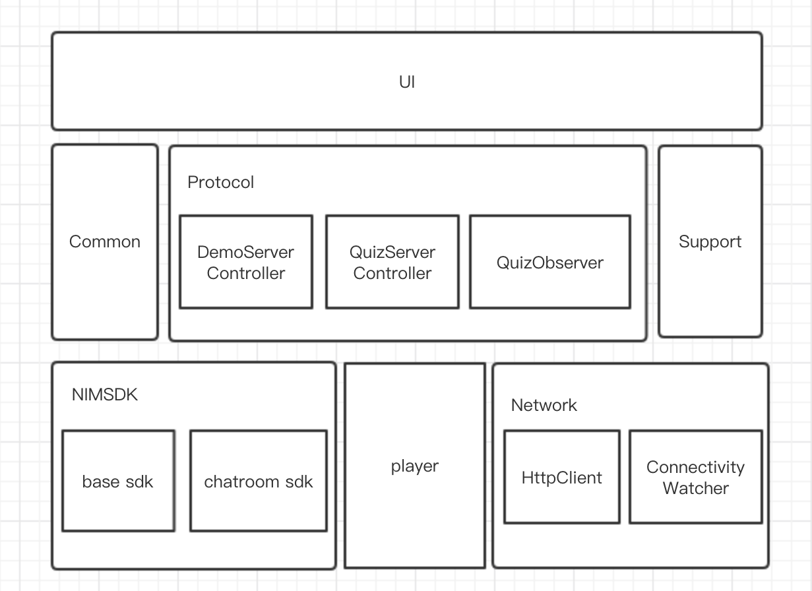

# 直播竞答 Android 实现说明

## 一、终端整体逻辑介绍

该答题解决方案的流程推进需要 PC 端作为主播端进行推流，客户端作为观众端进行拉流并参与答题，同时根据答题情况，在客户端分为两种角色：`答题者`和`观众`。`答题者`可参与答题；在答错或者未及时进入答题流程的则被称为`观众`，`观众`不可答题，但仍可看题以及发送消息进行互动。

整体答题流程分为以下几个步骤：

1. 输入房间号进入房间，在房间内可一直进行聊天，如果主播已经开始直播即推流，则房间内有主播画面显示，若没有推流，则无画面。
2. 当主播端开始下发题目之后，若此时在房间内，则可以参与答题，若下发题目之后，仍未进入房间，则不能参与作答，解决方案共提供三道题作答。
3. 答题过程有一次自动复活机会，若答错一道题，会自动使用复活机会复活；若答错一道题，且用掉一次复活时，仍然答错，则判定为闯关失败，无法继续答题平分奖金。若答对所有题或者使用一次复活机会后，答对剩余题目，均判定为闯关成功，最终平分奖金。
4. 答题环节结束后，主播端会退出房间，拉流端也会收到回调，离开房间，一次答题流程结束。

## 二、场景重难点实现

### 1. 题目，答案以及冲关结果的显示逻辑

（1）初始化 QuizObserver, 并注册 observeQuiz 监听器

（2）根据收到的通知命令 quizNotification.getCmd()，判断是题目，答案或冲关结果，并将内容存储在本地

（3）注册拉流接口 registerPlayerCurrentSyncTimestampListener，监听返回的时间戳，与收到的待显示的内容中的时间戳进行比较

（4）当拉流时间戳大于待显示内容的时间戳时，显示相对应的题目，答案或冲关结果

### 2. 观众拉流实现

（1）初始化 VideoOptions，并设置相应参数

（2）初始化 NIMLivePlayer，传入拉流地址，以及 VideoOptions

（3）注册 registerPlayerCurrentSyncTimestampListener 监听器，监听返回的拉流时间戳

（4）注册 registerPlayerObserver，监听播放器的状态回调

（5）调用 setupRenderView 接口，传入 NIMLiveSurfaceView， 设置视频布局 

（6）调用 asyncInit，异步初始化播放器接口

（7）通过以上几个步骤，即可实现观众端拉流功能，不需要关心断网重连等情况，播放器 SDK 将自动处理

## 三、 Demo源码导读

### 工程说明

Android 直播竞答 Demo 工程基于以下开发

1. 网易云信 basesdk 、 chatroom，版本为 4.7.2
2. 播放器 player， 版本为 1.1.1
3. 日志库 nim_log，版本为 1.3.0
4. 热更新 hotfix， 版本为 1.1.3
5. View 注入 Butter Knife，版本为 8.8.1
6. 图片加载库 Glide，版本为 4.2.0
7.  JDK 使用 1.8.0

### 工程结构

#### 目录结构

com.netease.nim.quizgame

|———— app			# app相关配置

|———— common		# 通用ui组件、utils、第三方支持库

|———— protocol		# 与服务器交互的协议

|____ ui				# 界面层实现

#### 总体结构



#### 详细说明

**1. 模块说明**

**app模块** 定义了 App 相关配置，提供了用户登录信息以及崩溃日志等。

**common模块** 定义了通用 UI 组件和工具类，包含界面的基类定义，使用到的 RecyclerView，Dialog 以及其他通用工具类。

**protocol 模块** 定义了与服务器交互的协议。主要有应用服务器客户端，游戏过程答题控制器和游戏过程监听器。

**ui 模块** 是主要的界面层实现。activity 包含了界面实现，adapter 包含了消息列表适配器和冲关结果列表适配器，cache 用于聊天室自定义消息缓存，constant 包含答题过程中的状态常量，model 包含了数据模型，module 包含了界面拆分的模块。

**2. 主要类说明**

**WelcomeActivity：** 从云信服务器获取登录信息，登录云信 SDK。

**MainActivity：**主界面，可以输入聊天室 id，进入聊天室。

**QuizBaseActivity：** 直播答题界面基类，主要实现聊天列表以及直播拉流。

**QuizActivity：**竞猜答题界面，实现了竞猜答题的主要流程。

**DemoServerController：**  网易云信 Demo Http 客户端，提供了请求帐号信息和获取聊天室信息的接口。

**QuizServerController：**与网易云信 Demo Http 客户端互动，提供了竞猜答题接口。

**QuizObserver：**游戏过程监听器，监听聊天室过程中的自定义消息，用来显示题目，显示答案，显示结果以及退出房间。

### 主要接口说明

#### 应用服务器接口

##### 请求帐号信息

```
public void fetchLoginInfo(final IHttpCallback<TouristLoginInfo> callback)
```

- 参数说明

TouristLoginInfo 说明：

| TouristLoginInfo 接口 | 说明     |
| :------------------ | :----- |
| getAccount()        | 获取用户帐号 |
| getToken()          | 获取用户密码 |
| getNickname()       | 获取用户昵称 |

##### 获取聊天室信息

```JAVA
public void fetchRoomInfo(String roomId, final IHttpCallback<RoomInfo> callback) 
```

- 参数

| RoomInfo 接口          | 说明           |
| :------------------- | :----------- |
| getRoomId()          | 获取聊天室id      |
| getName()            | 获取聊天室名称      |
| getCreator()         | 获取聊天室创建者     |
| getRtmpPullUrl()     | 获取 rtmp 拉流地址 |
| getHttpPullUrl()     | 获取 http 拉流地址 |
| getHlsPullUrl()      | 获取 hls 拉流地址  |
| getLiveStatus()      | 获取直播状态       |
| isRoomStatus()       | 获取房间是否有效状态   |
| getOnlineUserCount() | 获取在线人数       |
| getBonus()           | 获取奖金总数       |
| getAddr()            | 获取独立模式聊天室 ip |
| getQuestionCount()   | 获取问题总数       |

##### 提交答案

```java
public void answer(String roomId, long questionId, int answer, final DemoServerController.IHttpCallback<Integer> callback)
```

- 参数

| 参数         | 说明                          |
| ---------- | --------------------------- |
| roomId     | 聊天室 id                      |
| questionId | 问题 id                       |
| answer     | 选中的答案 id                    |
| callback   | 服务器返回的答案正确与否。0 错误，1 正确，2 无效 |

#### 游戏过程监听

##### 初始化

```java
public void init(String roomId, String creator)
```

- 参数

| 参数      | 说明       |
| ------- | -------- |
| roomId  | 聊天室 id   |
| creator | 聊天室创建者帐号 |

##### 注销

退出 Activity 时调用，会自动注销游戏监听器。

```java
public void destroy()
```

##### 监听游戏过程通知事件

```java
public void observeQuiz(Observer<QuizNotification> observer, boolean register) 
```

- 参数说明

QuizNotification 参数说明

| QuizNotification 参数 | 说明                            |
| ------------------- | ----------------------------- |
| getCmd()            | 获取游戏过程通知，可参考 QuizProcessState |
| getQuestionInfo()   | 获取题目相关信息，参考 QuestionInfo      |
| getTime()           | 获取该通知需要显示的拉流时间戳               |
| getWinnerCount()    | 获取获胜人数                        |
| getBonus()          | 获取获胜人均奖金                      |
| getWinnerSample()   | 获取获胜玩家列表                      |

QuizProcessState 参数说明

| QuizProcessState 参数 | 说明     |
| ------------------- | ------ |
| SET_QUESTION        | 出题     |
| ANNOUNCE_ANSWER     | 公布答案   |
| RESULT              | 公布冲关结果 |

QuestionInfo 参数说明

| QuestionInfo 参数  | 说明                                 |
| ---------------- | ---------------------------------- |
| getQuestionId()  | 问题 id                              |
| getOrder()       | 问题顺序                               |
| getQuestion()    | 问题内容                               |
| getRightAnswer() | 正确答案 id，与 AnswerOption 中的 选项 id 一致 |
| getOptions()     | 选项内容，参见 AnswerOption               |

AnswerOption 参数说明

| AnswerOption 参数  | 说明       |
| ---------------- | -------- |
| getOptionId()    | 选项 id    |
| getContent()     | 选项内容     |
| getSelectCount() | 选择该选项的人数 |

