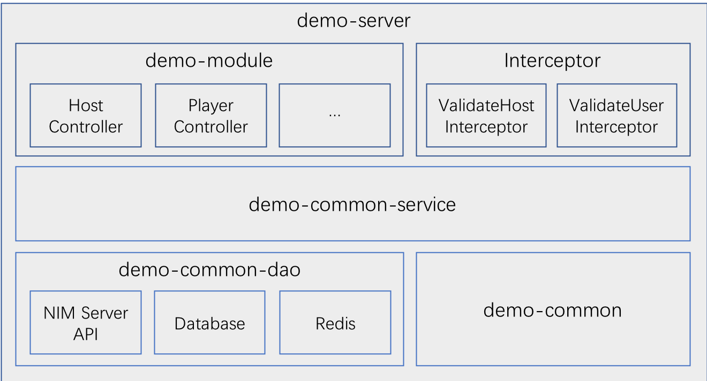

# 网易云信Quiz Server实现说明
## 1. 概述
### 1.1 应用服务器使用云信/视频云能力说明
直播竞答应用服务器结合**云信IM聊天室**以及**视频云直播**能力，依托网易云信/视频云服务，为直播竞答场景提供载体。直播能力提供视频推拉流，是直播竞答场景的基础。IM聊天室能力提供房间内消息互动，通过自定义聊天室消息进行游戏流程控制，通过聊天室高优先级消息保证流程关键消息的可靠送达。
### 1.2 应用服务器业务说明
+ 关于房间与游戏：  
	应用服务器会给主持人创建一个聊天室房间，这个房间是可以重复使用的，主持人可以控制当前游戏状态（未开始、已开始或已结束），结束当前游戏表示之后再进入房间会开始一局新的游戏。所以一个房间可以对应多场竞答游戏。
+ 关于题库  
	创建新游戏时会指定题目。为了简化业务逻辑，目前新游戏创建时都是指定的默认的3个题目。开发者可以根据实际场景对题目变更以及题库功能进行开发。
+ 关于回答  
	应用服务器会从题目下发成功开始计时，只有在有效时间内收到回答请求，并且回答的是正确的题目和有效的选项，才会对回答进行统计，有效回答会返回正确与否，无效回答直接返回无效。
+ 关于答错复活  
	目前采用自动复活一次的方式，答错或者超时未回答都将消耗自动复活机会。

## 2. 工程结构说明
### 2.1 技术框架
+ 项目依赖管理 Maven
+ Spring MVC 4.3.0.RELEASE
+ Spring Session 1.2.2.RELEASE
+ 数据库持久层框架 Mybatis 3.4.4
+ redis客户端 Redisson 1.2.1
+ Java Bean映射框架 Mapstruct 1.1.0.Final
+ Json处理框架 Fastjson 1.2.33
+ 日志框架 Slf4j 1.7.25 + Logback 1.2.3

### 2.2 逻辑架构


+ demo-server 模块，工程部署入口，包含权限校验拦截器、工程配置文件定义、全局异常处理等
+ demo-module 模块，对外接口定义，分为主持人相关接口，以及玩家相关接口两部分
+ demo-common-service 模块，业务逻辑实现层
+ demo-common-dao 模块，数据依赖，包含云信Api调用，数据库和缓存调用
+ demo-common 模块，工程常量定义以及工具类实现

## 3. 部署说明
### 3.1 前置条件
#### 3.1.1 Mysql数据库配置  
数据库配置完成后，需要确定如下配置：

+ 数据库地址：假设为`127.0.0.1:3306`
+ 数据库名称：默认设置为`appdemo`
+ 数据用户名：默认设置为`demouser`
+ 数据库密码：默认设置为`demopass`
+ 创建数据表：`demo_seq`、`demo_quiz_room`、`demo_quiz_question`、`demo_quiz_game`、`demo_quiz_tourist`以及`demo_quiz_answer_stats`
	
具体操作如下：
	
+ 确保已安装Mysql数据库（推荐版本5.5+）  
+ 创建数据库以及数据库用户（如果已有配置，可跳过，直接进行下一步）  
	
	``` 
	# 创建数据库，数据库名称可自定义
	CREATE DATABASE `appdemo` DEFAULT CHARACTER SET utf8 COLLATE utf8_general_ci;
	
	# 创建数据库用户
	CREATE USER 'demouser'@'%' IDENTIFIED BY 'demopass';
	
	# 赋予用户数据库操作权限
	GRANT ALL ON appdemo.* TO 'demouser'@'%';
	```
	**注意：为了简化和统一配置，数据库用户host设置为'%'，并且赋予了appdemo库的所有权限，安全级别较低，生产环境请自定义配置**
+ 创建数据表
	
	```
	# 建表语句
	use appdemo;
	
	# 全局递增序列号表，当前用于生成唯一游客id
	CREATE TABLE `demo_seq` (
	  `id` bigint(11) unsigned NOT NULL AUTO_INCREMENT,
	  PRIMARY KEY (`id`)
	) ENGINE=InnoDB AUTO_INCREMENT=10000 DEFAULT CHARSET=utf8 COMMENT='全局递增序列号表';
	
	# 直播竞答答案统计表
	CREATE TABLE `demo_quiz_answer_stats` (
	  `id` bigint(20) unsigned NOT NULL AUTO_INCREMENT COMMENT '主键id',
	  `game_id` bigint(20) NOT NULL COMMENT '游戏id',
	  `question_id` bigint(20) NOT NULL COMMENT '题目id',
	  `question_order` tinyint(4) NOT NULL DEFAULT '0' COMMENT '题目序号',
	  `answer_id` tinyint(4) NOT NULL COMMENT '选项id',
	  `select_count` bigint(20) NOT NULL DEFAULT '0' COMMENT '选择人数',
	  `created_at` timestamp NOT NULL DEFAULT '2018-01-01 08:00:00' COMMENT '记录创建时间',
	  `updated_at` timestamp NOT NULL DEFAULT CURRENT_TIMESTAMP ON UPDATE CURRENT_TIMESTAMP COMMENT '记录更新时间',
	  PRIMARY KEY (`id`),
	  UNIQUE KEY `idx_game_question_answer` (`game_id`,`question_id`,`answer_id`)
	) ENGINE=InnoDB AUTO_INCREMENT=1 DEFAULT CHARSET=utf8mb4 COMMENT='直播竞答答案统计表';
	
	# 直播竞答游戏表
	CREATE TABLE `demo_quiz_game` (
	  `id` bigint(20) unsigned NOT NULL AUTO_INCREMENT COMMENT '主键id',
	  `room_id` bigint(20) unsigned NOT NULL COMMENT '房间id',
	  `bonus` decimal(20,3) unsigned NOT NULL DEFAULT '0.000' COMMENT '奖金金额',
	  `questions` varchar(512) DEFAULT NULL COMMENT '竞答题目，逗号分隔',
	  `player_count` bigint(20) unsigned NOT NULL DEFAULT '0' COMMENT '参与人数',
	  `winner_count` bigint(20) unsigned NOT NULL DEFAULT '0' COMMENT '获奖人数',
	  `winner_sample` varchar(1024) DEFAULT NULL COMMENT '部分获奖名单',
	  `winner` text COMMENT '完整获奖名单',
	  `created_at` timestamp NOT NULL DEFAULT '2018-01-01 08:00:00' COMMENT '记录创建时间',
	  `updated_at` timestamp NOT NULL DEFAULT CURRENT_TIMESTAMP ON UPDATE CURRENT_TIMESTAMP COMMENT '记录更新时间',
	  PRIMARY KEY (`id`)
	) ENGINE=InnoDB AUTO_INCREMENT=1 DEFAULT CHARSET=utf8mb4 COMMENT='直播竞答游戏表';
	
	# 直播竞答题库表
	CREATE TABLE `demo_quiz_question` (
	  `id` bigint(20) unsigned NOT NULL AUTO_INCREMENT COMMENT '题目id',
	  `question` varchar(256) NOT NULL DEFAULT '' COMMENT '题目内容',
	  `options` varchar(512) NOT NULL DEFAULT '' COMMENT 'json格式的选项',
	  `right_answer` tinyint(4) NOT NULL COMMENT '正确答案id',
	  `created_at` timestamp NOT NULL DEFAULT '2018-01-01 08:00:00' COMMENT '记录创建时间',
	  `updated_at` timestamp NOT NULL DEFAULT CURRENT_TIMESTAMP ON UPDATE CURRENT_TIMESTAMP COMMENT '记录更新时间',
	  PRIMARY KEY (`id`)
	) ENGINE=InnoDB AUTO_INCREMENT=1000 DEFAULT CHARSET=utf8mb4 COMMENT='直播竞答题库表';
	
	# 直播竞答房间表
	CREATE TABLE `demo_quiz_room` (
	  `id` bigint(20) unsigned NOT NULL AUTO_INCREMENT COMMENT '主键ID',
	  `room_id` bigint(20) unsigned NOT NULL COMMENT '聊天室房间号',
	  `creator` varchar(64) NOT NULL COMMENT '房主账号',
	  `creator_token` varchar(64) NOT NULL DEFAULT '' COMMENT '房主IM token',
	  `name` varchar(128) NOT NULL COMMENT '房间名称',
	  `device_id` varchar(64) NOT NULL DEFAULT '' COMMENT '主播设备号',
	  `game_id` bigint(20) unsigned NOT NULL COMMENT '游戏id',
	  `game_status` tinyint(4) unsigned NOT NULL DEFAULT '0' COMMENT '游戏状态，0-未开始，1-已开始，2-已结束',
	  `cid` varchar(64) DEFAULT NULL COMMENT '直播频道ID',
	  `push_url` varchar(255) DEFAULT NULL COMMENT '推流地址',
	  `rtmp_pull_url` varchar(255) DEFAULT NULL COMMENT 'rtmp拉流地址',
	  `hls_pull_url` varchar(255) DEFAULT NULL COMMENT 'hls拉流地址',
	  `http_pull_url` varchar(255) DEFAULT NULL COMMENT 'http拉流地址',
	  `created_at` timestamp NOT NULL DEFAULT '2018-01-01 08:00:00' COMMENT '创建时间',
	  `updated_at` timestamp NOT NULL DEFAULT CURRENT_TIMESTAMP ON UPDATE CURRENT_TIMESTAMP COMMENT '更新时间',
	  PRIMARY KEY (`id`),
	  UNIQUE KEY `idx_deviceid` (`device_id`),
	  UNIQUE KEY `idx_roomid` (`room_id`)
	) ENGINE=InnoDB AUTO_INCREMENT=84 DEFAULT CHARSET=utf8 COMMENT='直播竞答房间表';
	
	# 直播竞答玩家账号表
	CREATE TABLE `demo_quiz_tourist` (
	  `id` bigint(20) NOT NULL AUTO_INCREMENT COMMENT '主键ID',
	  `accid` varchar(64) NOT NULL COMMENT '玩家账号',
	  `nickname` varchar(64) NOT NULL COMMENT '玩家昵称',
	  `im_token` varchar(64) NOT NULL DEFAULT '' COMMENT 'im token',
	  `available_at` bigint(20) NOT NULL DEFAULT '0' COMMENT '玩家账号被释放的毫秒时间戳',
	  `created_at` timestamp NOT NULL DEFAULT '2018-01-01 08:00:00' COMMENT '创建时间',
	  `updated_at` timestamp NOT NULL DEFAULT CURRENT_TIMESTAMP ON UPDATE CURRENT_TIMESTAMP COMMENT '更新时间',
	  PRIMARY KEY (`id`),
	  UNIQUE KEY `idx_accid` (`accid`),
	  KEY `idx_available_at` (`available_at`)
	) ENGINE=InnoDB AUTO_INCREMENT=13054 DEFAULT CHARSET=utf8mb4 COMMENT='直播竞答玩家账号表';
	```
	
#### 3.1.2 Redis配置  
确定redis配置信息：

+ redis地址：假设为`127.0.0.1:6379`
+ redis密码：假设未设置密码

#### 3.1.3 云信App配置  
从[云信控制台](https://app.netease.im/index#/)获取应用信息，假设为：

+ `App Key: bc01d41ebc78d6v5kn23a83d33f08n9c`
+ `App Secret: cl2k6c7p3xh0`
	
确保应用开通以下功能：  
	
+ 实时音视频
+ 直播
+ 聊天室

#### 3.1.4 Maven配置
确保服务器已安装 Maven  
执行 `mvn -v`命令能看到 maven相关信息输出

```
$ mvn -v
Apache Maven...
Maven home...
```

### 3.2 工程配置
配置文件根据环境不同，位于不同的路径下，部署时通过指定 Maven Profile 属性，使用指定环境的配置文件。目前已有配置文件的路径如下，其中`dev`表示开发环境，`test`表示测试环境，`pre`表示预发步环境，`prod`表示线上生产环境。相关的Maven配置位于工程目录`demo-server/pom.xml`文件的`profiles`节点中，默认启用开发环境`dev`。

```
demo-server/src/main/resources/profile
├── dev
│   ├── config.properties
│   ├── db.properties
│   └── logback.xml
├── pre
│   ├── config.properties
│   ├── db.properties
│   └── logback.xml
├── prod
│   ├── config.properties
│   ├── db.properties
│   └── logback.xml
└── test
    ├── config.properties
    ├── db.properties
    └── logback.xml
```

+ `config.properties`文件配置
	- 云信服务端api接口地址配置：`nim.server.api.url=https://api.netease.im/nimserver/`
	- 视频云直播api接口地址配置：`vcloud.server.api.url=https://vcloud.163.com/`
	- AppKey配置：`appkey=bc01d41ebc78d6v5kn23a83d33f08n9c`
	- AppSecret配置：`appsecret=cl2k6c7p3xh0`
+ `db.properties`文件配置
	- Mysql配置  
	
		```
		mysql.driver=com.mysql.jdbc.Driver
		mysql.url=jdbc:mysql://127.0.0.1:3306/appdemo?useUnicode=true&characterEncoding=utf-8&allowMultiQueries=true
		mysql.user=demouser
		mysql.pwd=demopass
		```
	- Redis配置
	
		```
		redis.ip=127.0.0.1
		redis.port=6379
		redis.password=
		```
+ `logback.xml`文件配置
	- 指定工程日志路径  
		默认配置为：`<property name="log.dir" scope="context" value="${catalina.home}/logs"/>`
		可以根据需要自定义工程日志路径

### 3.3 项目部署

+ 通过war包部署  
	切换到工程根目录下，执行以下操作：
	
	```
	# 从父工程打包，使用开发环境配置文件，跳过单元测试
	$ mvn clean install -Pdev -Dmaven.test.skip=true
	```
	打包成功后，会生成war包 `demo-server/target/appdemo.war`  
	接下来就可以将war包发布到已有tomcat的`webapps`目录下进行部署
+ 直接通过`maven tomcat`插件部署  
	项目父工程`pom.xml`文件中已经定义好了插件配置，默认部署到tomcat根目录下，并指定端口`8088`。
	
	```
    <plugin>
        <groupId>org.apache.tomcat.maven</groupId>
        <artifactId>tomcat7-maven-plugin</artifactId>
        <version>2.1</version>
        <configuration>
            <path>/</path>
            <port>8088</port>
            <charset>UTF-8</charset>
            <uriEncoding>UTF8</uriEncoding>
        </configuration>
    </plugin>
	```
	切换到工程根目录下，执行以下操作：
	
	```
	# 从父工程打包，使用开发环境配置文件，跳过单元测试
	$ mvn clean install -Pdev -Dmaven.test.skip=true
	
	# 切换到 demo-server 模块
	$ cd demo-server
	
	# 通过tomcat插件启动
	$ mvn tomcat7:run
	```

## 4. 接口描述
### 4.1 主播相关接口

#### 4.1.1 鉴权说明
所有主播相关的接口，都需要使用在获取房间信息时拿到的`password`进行鉴权

#### 4.1.2 获取房间信息
+ 接口说明  
	PC端通过`deviceId`获取房间信息，每一个`deviceId`对应一个房间，可重入
+ 请求说明

	```
	POST http://${Host}/quiz/host/create HTTP/1.1
	Content-Type: application/x-www-form-urlencoded;charset=utf-8
	```
+ 参数说明	

	|名称	|类型	|说明    |必须|
	|:------|:-----:| :-----|:---:|
	|deviceId|String| 主播端设备id |是|
	|bonus|String| 奖金数量|是|
	|ext|String| json格式扩展字段|否|

+ 返回说明  
	http 响应：**JSON**
	
	```
	//成功结果示例
	"Content-Type": "application/json; charset=utf-8"
	{
	    "code": 200,
	    "data": {
	        "roomId": 21112313,   // 房间id
	        "name": "quizRoom10086", // 房间名称
	        "creator": "host10086", // 房主账号
	        "bonus": 100000, // 奖金金额
	        "password":"password", // 主播密码
	        "gameStatus": 1, // 游戏状态，0-未开始，1-已开始，2-已结束
	        "rtmpPullUrl": "rtmp://xxxxx.live.126.net/live/xxxxxxxx", // 房间拉流地址
	        "hlsPullUrl": "http://xxxxx.live.126.net/live/xxxx/playlist.m3u8",
	        "httpPullUrl": "http://xxxxx.live.126.net/live/xxxx.flv?netease=xxxx.live.126.net",
	        "pushUrl": "rtmp://xxxxxx.live.126.net/live/xxxxx?wsSecret=xxxx&wsTime=1515922702", // 房间推流地址
	        "questionCount": 3, // 题目数量
	        "questionInfo": [ //题目信息
	            {
	                "questionId": 100, // 题目id
	                "question": "馒头是谁发明的？", // 题目内容
	                "order": 0, // 题目序号
	                "rightAnswer": 1, // 正确答案
	                "options": [ // 选项信息
	                    {
	                        "optionId": 0, // 选项id
	                        "content": "李冰" // 选项内容
	                    },
	                    {
	                        "optionId": 1,
	                        "content": "诸葛亮"
	                    },
	                    {
	                        "optionId": 2,
	                        "content": "曹操"
	                    }
	                ]
	            },
	            {
	                "questionId": 101,
	                "question": "山东山西的\"山\"指的是？",
	                "order": 1,
	                "rightAnswer": 1,
	                "options": [
	                    {
	                        "optionId": 0,
	                        "content": "泰山"
	                    },
	                    {
	                        "optionId": 1,
	                        "content": "太行山"
	                    },
	                    {
	                        "optionId": 2,
	                        "content": "沂蒙山"
	                    }
	                ]
	            },
	            {
	                "questionId": 102,
	                "question": "以下哪一类茶是半发酵茶？",
	                "order": 2,
	                "rightAnswer": 2,
	                "options": [
	                    {
	                        "optionId": 0,
	                        "content": "绿茶"
	                    },
	                    {
	                        "optionId": 1,
	                        "content": "福茶"
	                    },
	                    {
	                        "optionId": 2,
	                        "content": "乌龙茶"
	                    }
	                ]
	            }
	        ]
	    }
	}
	
	//失败结果示例
	{
	    "code": 400,
	    "msg":"参数错误"
	}
	```
	
#### 4.1.3 变更活动状态
+ 接口说明  
	开始或者结束直播时，通知服务器
+ 请求说明

	```
	POST http://${Host}/quiz/host/switch HTTP/1.1
	Content-Type: application/x-www-form-urlencoded;charset=utf-8
	```
+ 参数说明	

	|名称	|类型	|说明    |必须|
	|:------|:-----:| :-----|:---:|
	|roomId|Long| 主播房间id |是|
	|password|String| 主播密码|是|
	|status|String| 直播状态，0-未开始/1-进行中/2-结束|是|

+ 返回说明  
	http 响应：**JSON**
	
	```
	//成功结果示例
	"Content-Type": "application/json; charset=utf-8"
	{
	  "code": 200
	}
	
	//失败结果示例
	{
	    "code": 500,
	    "msg":"发送失败"
	}
	```
	
#### 4.1.4 出题接口
+ 接口说明  
	通过聊天室消息出题
+ 请求说明

	```
	POST http://${Host}/quiz/host/question/publish HTTP/1.1
	Content-Type: application/json;charset=utf-8
	```
+ 参数说明	

	|名称	|类型	|说明    |必须|
	|:------|:-----:| :-----|:---:|
	|roomId|Long| 主播房间id |是|
	|password|String| 主播密码|是|
	|questionId|Long| 题目id |是|
	|content|String| json格式公布内容, post data数据|是|

+ 返回说明  
	http 响应：**JSON**
	
	```
	//成功结果示例
	"Content-Type": "application/json; charset=utf-8"
	{
	  "code": 200,
	}
	
	//失败结果示例
	{
	    "code": 500,
	    "msg":"发送失败"
	}
	```

#### 4.1.5 查询答题结果
+ 接口说明  
	查询指定题目的答题结果，包括各选项回答人数统计。  
	如果是最后一道题，还会返回获胜玩家名单和奖励金额。
+ 请求说明

	```
	POST http://${Host}/quiz/host/result/query HTTP/1.1
	Content-Type: application/x-www-form-urlencoded;charset=utf-8
	```
+ 参数说明	

	|名称	|类型	|说明    |必须|
	|:------|:-----:| :-----|:---:|
	|roomId|Long| 主播房间id |是|
	|password|String| 主播密码|是|
	|questionId|Long| 查询的题目id|是|

+ 返回说明  
	http 响应：**JSON**
	
	```
	//成功结果示例
	"Content-Type": "application/json; charset=utf-8"
	{
	    "code": 200,
	    "data": {
	        "questionId": 100,
	        "question": "馒头是谁发明的？",
	        "order": 0,
	        "rightAnswer": 1, // 正确答案
	        "selectCount": 9, // 答题总人数
	        "options": [
	            {
	                "optionId": 0,
	                "content": "李冰",
	                "selectCount": 0 // 选项选择人数
	            },
	            {
	                "optionId": 1,
	                "content": "诸葛亮",
	                "selectCount": 7
	            },
	            {
	                "optionId": 2,
	                "content": "曹操",
	                "selectCount": 2
	            }
	        ],
	        "bonusInfo": {
	          "playerCount": 3000, // 游戏参与人数
              "winnerCount": 1000, // 存活人数
              "winnerSample": [ // 优胜者示例
                "a",
                "b",
                "c",
                "d"
              ],
              "bonus": 200 // 优胜者赢得金额
            }
	    }
	}
	
	//失败结果示例
	{
	    "code": 1202,
	    "msg":"答题进行中"
	}
	```
	
#### 4.1.6 公布答案
+ 接口说明  
	通过聊天室消息公布答案
+ 请求说明

	```
	POST http://${Host}/quiz/host/result/publish HTTP/1.1
	Content-Type: application/json;charset=utf-8
	```
+ 参数说明	

	|名称	|类型	|说明    |必须|
	|:------|:-----:| :-----|:---:|
	|roomId|Long| 主播房间id |是|
	|password|String| 主播密码|是|
	|content|String| json格式公布内容, post data数据|是|

+ 返回说明  
	http 响应：**JSON**
	
	```
	//成功结果示例
	"Content-Type": "application/json; charset=utf-8"
	{
	  "code": 200,
	}
	
	//失败结果示例
	{
	    "code": 500,
	    "msg":"发送失败"
	}
	```
	
### 4.2 玩家相关接口
#### 4.2.1 获取账号信息
+ 接口说明  
	获取可用的账号信息
+ 请求说明

	```
	POST http://${Host}/quiz/player/create HTTP/1.1
	Content-Type: application/x-www-form-urlencoded;charset=utf-8
	```
+ 参数说明	

	|名称	|类型	|说明    |必须|
	|:------|:-----:| :-----|:---:|
	|sid|String| 如果当前已有正在使用的accid |否|

+ 返回说明  
	http 响应：**JSON**
	
	```
	//成功结果示例
	"Content-Type": "application/json; charset=utf-8"
	{
	  "code": 200,
	  "data": {
	    "accid": "accid",
	    "nickname": "nickname",
	    "imToken": "imToken"
	  }
	}
	
	//失败结果示例
	{
	    "code": 500,
	    "msg":"请求失败"
	}
	```
	
#### 4.2.2 获取房间信息
+ 接口说明  
	获取需要进入的房间信息
+ 请求说明

	```
	POST http://${Host}/quiz/player/room/query HTTP/1.1
	Content-Type: application/x-www-form-urlencoded;charset=utf-8
	```
+ 参数说明	

	|名称	|类型	|说明    |必须|
	|:------|:-----:| :-----|:---:|
	|sid|String| 当前accid |是|
	|roomId|Long| 请求进入的房间id|是|
	|addrType|String| 聊天室Link类型，WEB/COMMON，默认为COMMON|否|

+ 返回说明  
	http 响应：**JSON**
	
	```
	//成功结果示例
	"Content-Type": "application/json; charset=utf-8"
	{
	  "code": 200,
	  "data": {
	    "roomId": 12345678,
	    "name": "竞答", //房间名
	    "creator": "dddd", //房主账号
	    "rtmpPullUrl": "rtmp://12345.live.126.net/live/...",
	    "httpPullUrl": "http://12345.live.126.net/live/...",
	    "hlsPullUrl": "http://12345.live.126.net/live/...",
	    "roomStatus": true,
	    "liveStatus": 1,
	    "gameStatus": 0,
	    "onlineUserCount": 2000, //当前在线人数
	    "questionCount": 3, //该场次题数
	    "bonus": 10000 // 该场次奖金额度
	    "addr": [
            "123.456.789:9092",
            "123.456.789:8080"
        ]
	  }
	}
	
	//失败结果示例
	{
	    "code": 1203,
	    "msg":"答题已结束"
	}
	```
	
#### 4.2.3 提交答案
+ 接口说明  
	获取可用的账号信息
+ 请求说明

	```
	POST http://${Host}/quiz/player/answer HTTP/1.1
	Content-Type: application/x-www-form-urlencoded;charset=utf-8
	```
+ 参数说明	

	|名称	|类型	|说明    |必须|
	|:------|:-----:| :-----|:---:|
	|sid|String| 当前accid |是|
	|roomId|Long| 请求进入的房间id|是|
	|questionId|Long| 题目id| 是|
	|answer|Long|回答选项id|是|

+ 返回说明  
	http 响应：**JSON**
	
	```
	//成功结果示例
	"Content-Type": "application/json; charset=utf-8"
	{
	  "code": 200,
	  "data": {
	  		"result": 0 // 0-错误，1-正确，2-无效
	  }
	}
	
	//失败结果示例
	{
	    "code": 1200,
	    "msg":"直播已结束"
	}
	```